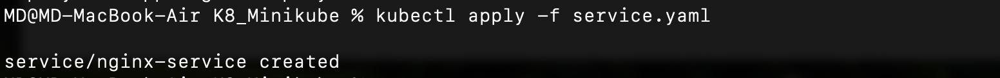
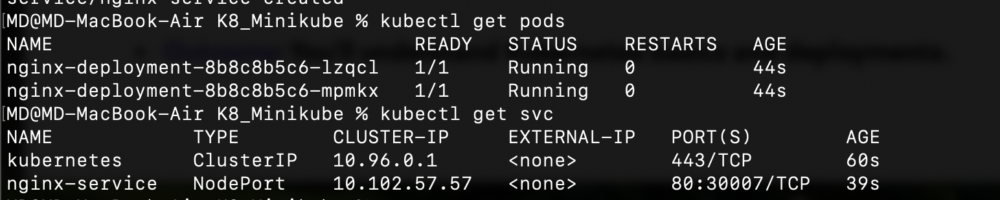
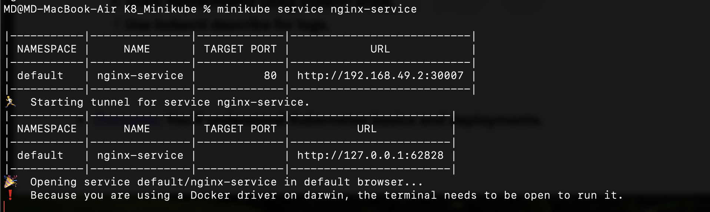
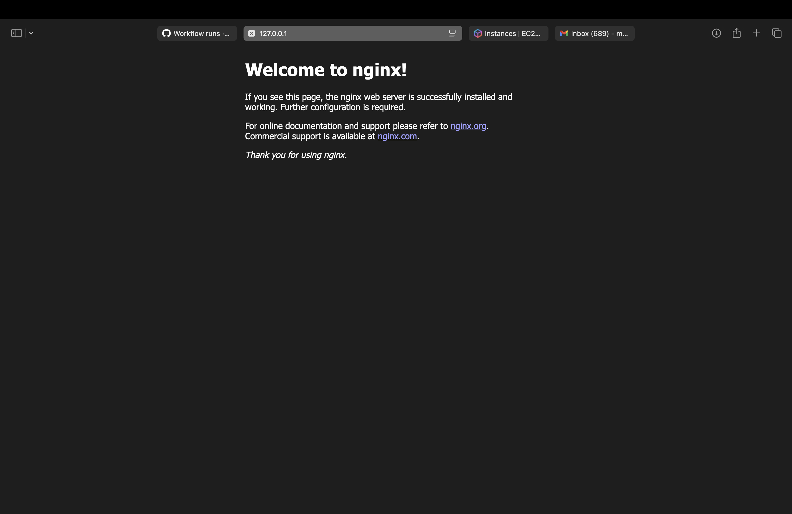
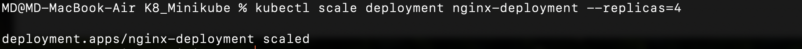
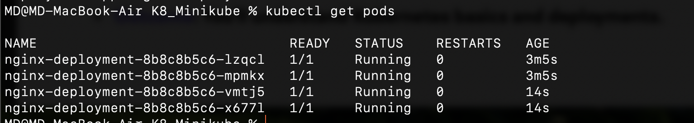
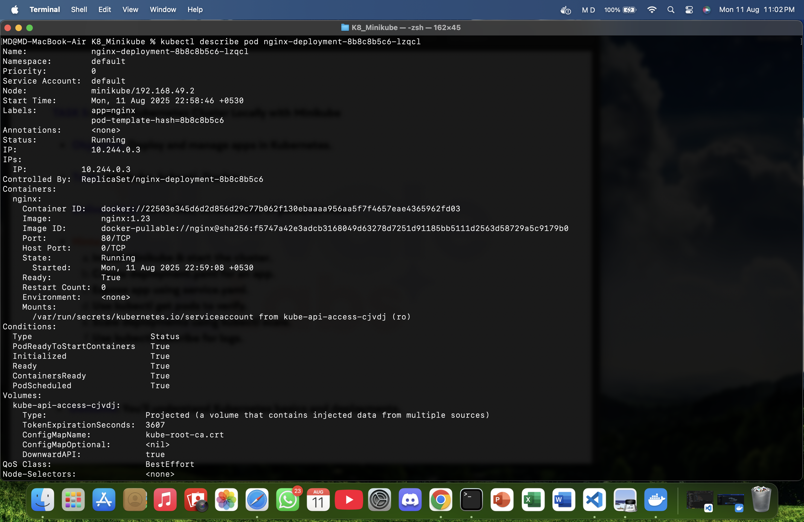
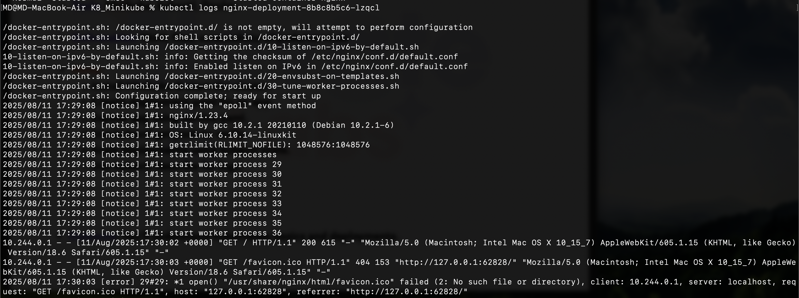

# TASK 5: Build a Kubernetes Cluster Locally with Minikube

## Objective
Deploy and manage an application locally using Kubernetes.  
Tools used: **Minikube**, **kubectl**, **Docker**.

---

## 1. Verified Installation
```bash
minikube version
kubectl version --client
```

## 2. Start Minikube Cluster
I started the local Kubernetes cluster:
```bash
minikube start --driver=docker
```

Verified the status:
```bash
minikube status
```


## 3. Create Deployment (deployment.yaml)
I created a deployment file for the nginx application:
``` bash
apiVersion: apps/v1
kind: Deployment
metadata:
  name: nginx-deployment
  labels:
    app: nginx
spec:
  replicas: 2
  selector:
    matchLabels:
      app: nginx
  template:
    metadata:
      labels:
        app: nginx
    spec:
      containers:
      - name: nginx
        image: nginx:1.23
        ports:
        - containerPort: 80
```
Applied the deployment:
``` bash
kubectl apply -f deployment.yaml
```


## 4. Create Service (service.yaml)
I created a service to expose the application:
``` bash
apiVersion: v1
kind: Service
metadata:
  name: nginx-service
spec:
  type: NodePort
  selector:
    app: nginx
  ports:
    - port: 80
      targetPort: 80
      nodePort: 30007
```

Applied the service:
``` bash 
kubectl apply -f service.yaml
```
## 5. Verify Pods & Services
Checked if pods and services were running:
```bash
kubectl get pods
kubectl get svc
```



## 6. Access the Application
Opened the application in the browser:
``` bash
minikube service nginx-service
```




## 7. Scale the Deployment
Scaled from 2 to 4 replicas:
``` bash
kubectl scale deployment nginx-deployment --replicas=4
```
Verified scaling:
``` bash
kubectl get pods
``` 


## 8. Describe a Pod & View Logs
Described a pod:
``` bash
kubectl describe pod <ex name>
```
Viewed logs:
``` bash
kubectl logs <ex name>
``` 



